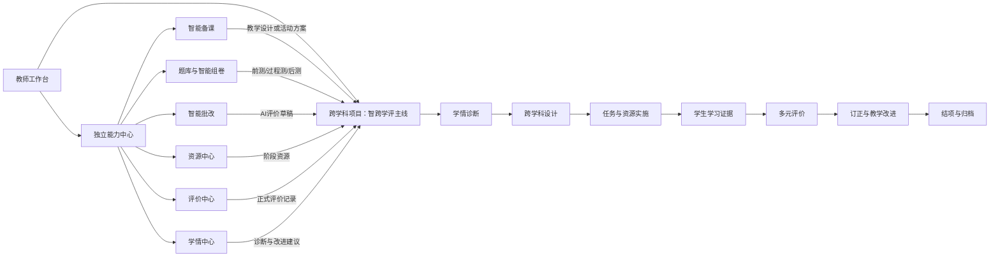

# 智跨学评产品重构设计规格

**状态：** 已审核并冻结，作为全项目重构的产品规格。  
**目标：** 将现有“功能菜单集合”重构为以跨学科项目为主线、以独立教学工具为补充、以学习证据为核心的数据闭环平台。

---

## 1. 产品定义

**智跨学评**不是一个单独功能，而是一种教学运行方式：教师围绕真实问题创建跨学科项目，在同一项目中完成学情诊断、教学设计、任务实施、过程评价、学习改进和成果归档；AI在每个阶段提供有来源、可审核、可追溯的辅助。

平台由两个层次组成：

1. **项目主线：** 跨学科项目承载完整教学闭环，是所有正式教学数据的归属地。
2. **能力中心：** 智能备课、题库组卷、智能批改、资源、评价和学情等工具可被独立使用，也可被带入项目使用。

核心原则：**入口可以多个，业务事实只能有一份；工具可以独立，正式教学过程必须可回到项目。**

## 2. 重构目标与非目标

### 2.1 必达目标

- 教师只需进入一个项目，即可看清下一步要做什么、学生进行到哪里、哪些评价未确认、哪些学习目标尚未达成。
- 每个项目都能证明“跨学科”不是学科标签堆叠：存在真实问题、学科贡献、共同成果和学科证据。
- 每条学生提交、评价、订正和再评价都进入同一学习证据链。
- AI结果始终标明来源、调用状态、适用上下文和教师采纳状态；AI不能直接成为学生最终成绩或正式教学结论。
- 独立工具可高效完成普通教学工作，并能一键关联已有项目，不产生重复数据。
- 管理端能够查看合规范围内的项目、AI调用和真实运营数据。

### 2.2 本轮明确不做的能力

- 不建设家长端完整门户。
- 不建设多校协同编辑、实时共同备课或社交化资源社区。
- 不让AI自动发布任务、自动确定最终分数、自动归档项目。
- 不通过随机数据、模板回退或静默模拟数据伪装AI能力与学情结果。

## 3. 核心业务架构



### 3.1 项目主线的七个阶段

| 阶段 | 教师完成的关键动作 | 学生获得的体验 | 产生的核心数据 |
| --- | --- | --- | --- |
| 1. 学情诊断 | 选择班级、导入或选择已有学习证据、确认AI分析 | 无需进入 | 班级画像、薄弱点、分层建议 |
| 2. 跨学科设计 | 定义真实问题、学科贡献、目标、指标和证据计划 | 无需进入 | 项目设计快照 |
| 3. 备课与准备 | 生成/编辑活动方案、资源包和分层任务链 | 无需进入 | 教案、资源、任务草稿 |
| 4. 学习实施 | 分配并发布任务、跟进过程和提交 | 查看目标、资源、任务、量规并提交过程成果 | 任务分配、草稿、提交、协作证据 |
| 5. 多元评价 | 使用量规评价，审阅AI建议，发布反馈 | 自评、互评、查看已发布反馈 | 评价记录、反馈、能力达成 |
| 6. 改进循环 | 查看学情变化，发布订正或提升任务，完成再评价 | 订正、再次提交、查看成长变化 | 改进任务、修订版本、再评价 |
| 7. 结项归档 | 确认成果、反思和可复用资产，归档项目 | 查看个人成长摘要 | 项目反思、匿名案例、可复用资源 |

项目阶段不是强制线性锁死。教师可以在已开放阶段之间往返调整，但以下约束必须成立：

- 未完成基本设计时不能发布正式任务。
- 未分配学生时不能发布任务。
- 未经教师发布的评价不得向学生展示。
- 存在未发布评价或未处理阻断问题时不能结项。
- 归档项目默认只读；重新开放必须有角色授权、原因和审计记录。

## 4. “智、跨、学、评”的可见定义

| 维度 | 不是 | 必须在产品中可见的事实 |
| --- | --- | --- |
| 智 | 孤立聊天、随机生成、AI直接判定 | AI使用项目上下文与学习证据；显示来源、状态、调用记录和教师采纳动作 |
| 跨 | 勾选多个学科标签 | 真实问题下每个学科的知识、思维、探究职责和共同成果证据 |
| 学 | 只上传一次最终作业 | 学生看到目标、资源、量规，经历草稿、提交、反馈、订正和成长记录 |
| 评 | 只填一个分数 | 目标、任务、证据和量规对应；教师评价、自评、互评和AI建议共同支撑改进 |

## 5. 信息架构与入口边界

### 5.1 教师一级导航

```text
工作台
智跨学评
  └─ 我的跨学科项目

备课与设计
  └─ 智能备课

题库与测评
  ├─ 题库管理
  ├─ 智能组卷
  └─ 试卷与批改

教学实施
  ├─ 任务中心
  ├─ 评价中心
  ├─ 资源中心
  └─ 学情中心
```

### 5.2 项目工作区导航

```text
项目总览
学情诊断
跨学科设计
备课与资源
任务实施
学习证据
评价与反馈
改进与再评价
结项与归档
```

项目总览固定显示：项目状态、项目班级、完成度、待办、学生参与概览、未发布评价、AI待确认事项、当前阶段和唯一的“下一步”主操作。

### 5.3 独立能力中心的边界

| 模块 | 独立使用时 | 关联项目时 | 不允许承担的职责 |
| --- | --- | --- | --- |
| 智能备课 | 创建个人教案或模板 | 自动带入项目主题、学情、目标，结果进入项目备课与资源 | 直接发布任务或替代教师确认 |
| 题库与智能组卷 | 生成普通测验或练习 | 标记为项目的前测、过程测或后测，成绩回流项目学情 | 生成无来源的“项目评价结论” |
| 智能批改 | 批改普通作业或试卷 | 基于项目量规生成评价草稿 | 直接发布最终分数或绕过量规 |
| 资源中心 | 保存、检索和复用资源 | 绑定到项目阶段、任务或学科贡献 | 复制出另一份项目资源事实 |
| 任务中心 | 跨项目查看待发布、临期、未提交和待处理任务 | 跳转项目任务实施页进行设计和分配 | 创建脱离项目的正式学习任务 |
| 评价中心 | 跨项目查看待评价与待发布反馈 | 跳转项目评价与反馈页进行确认 | 创建第二套评价数据 |
| 学情中心 | 查看班级、学生和阶段性学习变化 | 回到项目诊断或改进阶段 | 用模拟数据代替真实学习证据 |

## 6. 统一数据模型

### 6.1 领域实体

```text
Project
├── ProjectDesign
│   ├── AuthenticProblem
│   ├── SubjectContribution
│   ├── LearningGoal
│   ├── EvaluationIndicator
│   └── EvidencePlan
├── ProjectResource
├── LearningTask
│   └── TaskAssignment
├── LearningEvidence
│   ├── Submission
│   └── SubmissionRevision
├── EvaluationRecord
├── LearningInsight
├── ImprovementAction
├── AIJob / AIArtifact
└── ReusableAssetReference
```

### 6.2 单一事实来源

- **任务可见性：** `TaskAssignment` 是学生是否能看到正式任务的唯一依据。
- **评价：** `EvaluationRecord` 是所有新教师评价、AI草稿、自评、互评和再评价的唯一主记录；旧评价表只读兼容。
- **学习证据：** 每次提交、草稿保存、订正和再提交形成版本化证据，不覆盖第一次提交。
- **学情：** 只能由班级成员、任务、提交、已确认评价和测评结果计算，不能由随机数或前端硬编码生成。
- **AI：** 每次调用都有 `source`、`status`、`trace_id`、输入摘要、输出版本、教师采纳状态和关联项目上下文。
- **资产：** 资源、教案、试卷可复用，但在项目内只保存引用关系与使用上下文，不复制业务内容。

## 7. 独立工具与项目的连接机制

所有可产出教学内容的独立工具，在开始和保存时都提供一致的“工作上下文”选择：

```text
工作方式
○ 独立使用：保存为个人草稿、模板或普通教学内容
○ 关联项目：选择项目、阶段、目标、任务或评价指标
```

关联项目后，工具必须执行以下行为：

1. 自动带入项目可用的主题、学科、年级、班级、学情、目标和量规信息。
2. 保存结果时提供明确去向，例如“加入课前资源”“作为后测”“生成任务草稿”“创建AI评价草稿”。
3. 在结果页提供“返回所属项目”入口。
4. 在项目总览时间线上记录该工具产出的创建、采纳、发布或撤回动作。

独立使用的结果必须可以在之后手动“添加到项目”，但添加时要求重新选择项目位置，避免无上下文自动挂载。

## 8. AI能力设计

### 8.1 首批AI能力

| AI能力 | 输入 | 输出 | 教师必须确认的动作 |
| --- | --- | --- | --- |
| 学情分析助手 | 班级基础信息、前测、提交、已发布评价 | 班级画像、薄弱点、分层建议 | 采纳诊断与分层建议 |
| 项目设计助手 | 真实问题、学科、年级、课时、学情 | 学科贡献、目标、活动、任务链、量规草稿 | 保存到项目设计 |
| 任务分层助手 | 学习目标、班级画像、已有任务 | 基础/提升/拓展任务建议 | 创建或更新任务草稿 |
| 评价建议助手 | 项目量规、学生提交、历史反馈 | 分维度评价建议、反馈草稿、风险提示 | 调整、确认并发布评价 |
| 教学反思助手 | 任务完成、评价、订正和学情变化 | 达成分析、问题归因、下一轮建议 | 保存为项目反思或改进任务 |

### 8.2 AI治理规则

- Provider不可用、超时或返回格式异常时，界面显示失败和重试/人工处理入口，不生成模拟分数或绿色成功提示。
- AI草稿不能被学生看到，只有教师发布后的正式评价可见。
- AI输出默认不可直接写入正式项目数据，必须由教师点击“采纳并保存”。
- AI调用记录只向有权限的教师和管理员展示；学校管理员只能看到本校合规范围内的数据。

## 9. 学生端设计

学生端围绕“我的项目”和“我的学习证据”组织，不以教师后台结构复制页面。

```text
我的项目
├── 项目问题与最终成果
├── 我的阶段任务
├── 分层资源与评价标准
├── 草稿与提交记录
├── 已发布反馈
├── 订正任务
└── 成长记录
```

学生的每项任务必须看见：任务目标、提交要求、截止时间、关联资源、评价标准、剩余提交次数和当前状态。学生只能看见自己的提交、自己参与的小组必要信息和已发布评价。

## 10. 管理端与证据沉淀

管理端不参与项目业务编辑，负责以下事项：

- 用户、学校、班级、角色和AI Provider管理。
- 本校或全平台范围内的项目、任务、提交、评价、资源和AI调用真实统计。
- AI调用来源、教师采纳、失败率和审计日志。
- 结项项目的脱敏案例、优秀资源和量规模板沉淀。

任何学校管理员的列表、图表、导出和最近活动必须只返回本校数据。

## 11. 现有系统的迁移策略

### 11.1 保留并复用

- 登录认证、角色权限、学校班级、文件上传和审计基础设施。
- 项目、任务、资源、题库、试卷和AI Provider的可复用基础数据。
- 可安全映射到新模型的项目设计、学生提交和历史评价。

### 11.2 重点重建

- 项目工作区及其唯一下一步引导。
- 项目阶段与业务状态机。
- 任务分配、任务中心和项目任务链的职责边界。
- 统一评价记录和学生反馈页。
- 基于真实学习证据的学情、订正和再评价。
- AI上下文、来源、人工确认和可追溯性。
- 教师工作台与学校范围数据驾驶舱。

### 11.3 替代后下线

- 旧版项目详情页。
- 独立任务创建入口与项目任务链重复的编辑逻辑。
- 独立评价写入入口与项目评价记录重复的写入逻辑。
- 把本地模板、随机内容或静默回退显示为AI结果的页面逻辑。
- 无真实保存、无真实上传、无真实删除能力的伪功能入口。

下线顺序：先迁移到统一能力与统一数据，再隐藏旧入口，最后删除不再被引用的路由和服务。历史业务数据先以只读方式兼容，不直接删除。

## 12. 首个完整验收样板

样板项目固定为：**“保护海洋，从我做起”**。

| 维度 | 样板内容 |
| --- | --- |
| 真实问题 | 本地或校园周边水环境与海洋污染问题 |
| 核心学科 | 科学 |
| 支持学科 | 数学、语文、信息技术、道德与法治 |
| 共同成果 | 调查报告、数据图表、环保倡议或数字作品 |
| 前测 | 对污染、数据阅读和公共责任的基础测评 |
| 任务链 | 资料研读 → 调查与数据整理 → 方案设计与成果展示 |
| 评价 | 科学探究、数据分析、表达沟通、合作与责任四类指标 |
| 改进 | 根据反馈补充证据、修订方案、再次提交 |

### 12.1 样板通过口径

1. 教师可从项目中完成诊断、设计、任务分配、资源发布、评价、反思和归档。
2. 学生可看到被分配的任务、资源和量规，提交成果后只看到教师已发布的反馈。
3. AI至少在学情分析、项目设计、评价建议或教学反思中真实完成一次受治理调用，并留下来源和教师采纳记录。
4. 学校管理员可在本校范围查看真实项目和AI调用统计，不能看到其他学校数据。
5. 全流程不依赖手工输入UUID、修改数据库、使用伪数据或解释性绕行。

## 13. 设计完成定义

本规格完成后，实施团队应能明确回答：

- 某项功能属于项目主线还是独立能力中心？
- 某条数据的唯一事实来源是什么？
- 某项AI结果由谁确认、何时对学生可见？
- 某个独立工具如何关联回项目？
- 某个学生提交如何变成评价、改进和学情证据？

这些问题没有歧义时，才进入详细实施计划和代码改造。
